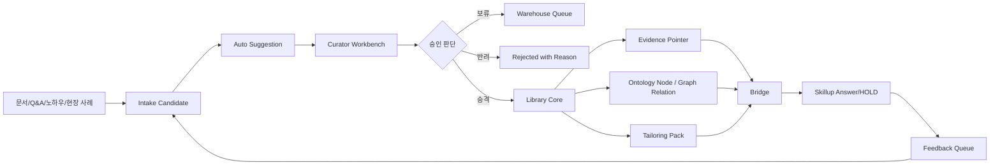

# 온톨로지와 시맨틱 기술 워크플로우 고도화 최종 개발 작업 가이드북

문서명: `ONTOLOGY_SEMANTIC_WORKFLOW_ENHANCEMENT_GUIDEBOOK_20260516_v1_0_FINAL.md`  
버전: **v1.0 FINAL**  
작성일: **2026-05-16 KST**  
문서 상태: **APPROVED_FOR_DEVELOPMENT_BASELINE_AND_COMPLETION_DECLARATION_RULESET**  
실행 검증 상태: **COMPLETION_GATE_DEFINED__F13_PROOFPACK_REQUIRED**  
저장소 적용 상태: **DECLARABLE_AFTER_REFERENCE_AND_ARTIFACT_VERIFICATION**  
적용 범위: **QLIB Warehouse, Library Core, Bridge, Skillup Education, Analytics, ProofPack, F13 Auto Intake & Curation**  
문서 성격: **최종 개발 작업 가이드북 / 시맨틱 계약 헌법 / F13 구현 기준 문서**  

---

## 0. 고정 선언

이 문서는 더 이상 “검토 보고서”가 아니다.

이 문서는 QLIB의 온톨로지와 시맨틱 기술 워크플로우 고도화를 실제 개발 작업으로 옮기기 위한 **최종 개발 작업 가이드북**이다.

이 문서가 고정하는 핵심은 다음이다.

```text
QLIB의 온톨로지 고도화는 거대한 그래프부터 시작하지 않는다.
먼저 창고에서 도서관으로 승격되는 모든 지식에
Evidence, Trace, Approval, Source Span, Shape 검증을 붙이는 것에서 시작한다.
```

이 문서는 다음 구조를 개발 기준으로 고정한다.

```text
문서·Q&A·노하우 입력
→ Intake Candidate
→ Auto Suggestion
→ Curator Review
→ Warehouse Hold 또는 Library Promotion
→ Evidence Pointer / Trace / Ontology-ready Field 생성
→ Bridge
→ Skillup Answer 또는 HOLD
→ Feedback Queue
→ 다시 Intake Candidate
```

이 문서는 다음을 금지한다.

```text
자동화가 정본을 직접 만들면 안 된다.
사람 승인 없이 도서관 승격하면 안 된다.
Evidence 없이 답변하면 안 된다.
Bridge를 우회해서 Skillup이 DB를 직접 조회하면 안 된다.
권리 제한 원문을 장문 노출하면 안 된다.
테스트·증거 없이 PASS를 선언하면 안 된다.
```

---

## 1. 초딩 버전 설명

QLIB를 학교라고 보면 다음과 같다.

```text
창고 = 아직 검사 안 끝난 물건을 두는 보관함
도서관 = 선생님이 확인해서 정식 교재로 올린 책장
Bridge = 학생이 책을 빌릴 때 반드시 지나가는 대출 창구
Skillup = 학생에게 설명해 주는 수업
Feedback Queue = 학생이 틀리거나 헷갈린 것을 다시 선생님 책상으로 보내는 질문함
ProofPack = 시험 채점지와 증거 파일
```

가장 중요한 규칙은 하나다.

```text
컴퓨터가 먼저 추천할 수는 있다.
하지만 정답으로 올리는 것은 사람이 승인해야 한다.
```

---

## 2. 문서 지위와 우선순위

### 2.1 문서 지위

| 항목 | 값 |
|---|---|
| 문서 상태 | `APPROVED_FOR_DEVELOPMENT_BASELINE_AND_COMPLETION_DECLARATION_RULESET` |
| Canonical 후보 여부 | YES |
| 공식 개발 작업 기준 여부 | YES |
| 실행 검증 여부 | `COMPLETION_GATE_DEFINED__F13_PROOFPACK_REQUIRED` |
| 저장소 실제 경로 검증 여부 | `DECLARABLE_AFTER_REFERENCE_AND_ARTIFACT_VERIFICATION` |
| 최종 사용자 승인 | 닥터 윤 요청에 따라 개발 기준 문서로 작성 |
| 코드 적용 승인 | 별도 필요 |
| 배포 승인 | 별도 필요 |

이 문서는 개발 작업의 기준이다.  
단, 이 문서는 자동으로 파일 수정, 코드 실행, 배포, 외부 API 호출 권한을 주지 않는다.

### 2.2 상위 문서 우선순위

충돌이 발생하면 다음 순서로 판단한다.

| 우선순위 | 문서 | 역할 |
|---:|---|---|
| 1 | 사용자 최신 명시 요청 | 작업 방향, 중단, 범위 변경 |
| 2 | `COMMON_DEVELOPMENT_WORKFLOW_CODEX_FINAL.md` | 최상위 개발 헌법 |
| 3 | `PROJECT_DEVELOPMENT_MEMORY.md` | 현재 프로젝트별 기억/가드레일 |
| 4 | `AGENTS.md` | Codex 실행 규칙 |
| 5 | `QLIB_COMPLETE_DEVELOPMENT_GUIDEBOOK_20260511_v1_2.md` | QLIB 제품군 통합 기준 |
| 6 | `PROJECT_DEVELOPMENT_GUIDEBOOK_창고_v1_0_FINAL.md` | Warehouse 실행 기준 |
| 7 | 이 문서 | 온톨로지/시맨틱 고도화 최종 개발 기준 |
| 8 | `F13_library_auto_intake_and_curation_v0.1.md` | 이 문서 기반 구현 스펙 |
| 9 | 임시 TODO, 대화 중 가정, 메모 | 보조 참고 |

충돌 처리 원칙은 다음과 같다.

```text
1. 상위 문서가 더 엄격하면 상위 문서를 따른다.
2. 하위 문서는 상위 문서의 안전 규칙을 완화할 수 없다.
3. 두 규칙이 충돌하면 더 안전한 규칙을 따른다.
4. 불명확하면 실행하지 않고 REVIEW_REQUIRED로 둔다.
5. 실행하지 않은 것은 NOT_EXECUTED다.
6. 검증하지 않은 것은 NOT_VERIFIED다.
```

---

## 3. Reference Manifest

이 문서가 참조하는 상위·관련 문서는 아래와 같다.

```yaml
reference_manifest:
  - doc_id: COMMON_DEV_WORKFLOW
    expected_path: COMMON_DEVELOPMENT_WORKFLOW_CODEX_FINAL.md
    required: true
    status: TRACKED

  - doc_id: PROJECT_MEMORY
    expected_path: PROJECT_DEVELOPMENT_MEMORY.md
    required: true
    status: TRACKED
    replaces_legacy_reference: PROJECT_DEVELOPMENT_MEMORY_PROMPT_CODEX_FINAL.md

  - doc_id: AGENTS
    expected_path: AGENTS.md
    required: true
    status: TRACKED

  - doc_id: QLIB_COMPLETE_GUIDEBOOK
    expected_path: QLIB_COMPLETE_DEVELOPMENT_GUIDEBOOK_20260511_v1_2.md
    required: true
    status: TRACKED

  - doc_id: WAREHOUSE_GUIDEBOOK
    expected_path: PROJECT_DEVELOPMENT_GUIDEBOOK_창고_v1_0_FINAL.md
    required: true
    status: TRACKED

  - doc_id: ONTOLOGY_SEMANTIC_GUIDEBOOK_FINAL
    expected_path: ONTOLOGY_SEMANTIC_WORKFLOW_ENHANCEMENT_GUIDEBOOK_20260516_v1_0_FINAL.md
    required: true
    status: THIS_DOCUMENT

  - doc_id: F13_SPEC
    expected_path: docs/feature_specs/F13_library_auto_intake_and_curation_v0.1.md
    required: true
    status: TRACKED
```

Legacy reference `PROJECT_DEVELOPMENT_MEMORY_PROMPT_CODEX_FINAL.md`의 상태는 `SUPERSEDED`다. 프로젝트 기억 생성 절차와 기본 템플릿은 `COMMON_DEVELOPMENT_WORKFLOW_CODEX_FINAL.md` §§32–33이, 현재 프로젝트별 기억과 가드레일은 `PROJECT_DEVELOPMENT_MEMORY.md`가 각각 승계한다. 이는 required-document contract 정합성 복구이며 기존 governance, runtime, deployment, security gate를 약화하지 않는다.

운영 규칙:

```text
Reference Manifest의 required=true 문서가 없으면 구현을 시작하지 않는다.
해당 문서가 없으면 먼저 문서 경로 검증 또는 문서 복구 작업을 수행한다.
```

---

## 4. 이 문서가 고정하는 것

이 문서는 다음을 고정한다.

| 번호 | 고정 항목 | 설명 |
|---:|---|---|
| 1 | Semantic-ready 계약 | RDF/OWL 이전에 필요한 최소 데이터 계약 |
| 2 | Warehouse/Library/Bridge/Skillup 경계 | 모듈별 책임과 금지사항 |
| 3 | 자동 입력 보조 | 자동화는 후보만 생성 |
| 4 | 사람 승인 원칙 | 정본 승격은 승인 필요 |
| 5 | Evidence Pointer | 근거 위치·권리·요약·사용 정책 |
| 6 | Trace | 후보 → 승인 → 승격 → 답변 사용 이력 |
| 7 | Source Span | 근거가 나온 원천 범위 |
| 8 | Approval Record | 누가, 무엇을, 왜 승인했는지 |
| 9 | Shape 검증 | JSON Schema 중심의 저장 전 검증 |
| 10 | Feedback Queue | Q&A/HOLD/오답을 다시 창고 후보로 회수 |
| 11 | Raw Leak 방어 | 권리 제한 원문 장문 노출 차단 |
| 12 | Quarantine/Rollback | 오연결·오승격·원문 노출 위험 격리 |
| 13 | ProofPack | 완료 증거와 gate 결과 저장 |
| 14 | Metrics/Analytics | 입력 시간, 자동 채움, HOLD, 오연결, raw leak 차단 기록 |
| 15 | F13 구현 기준 | `F13_library_auto_intake_and_curation_v0.1.md` 작성 기준 |

---

## 5. 이 문서가 고정하지 않는 것

이 문서는 다음을 최종 확정하지 않는다.

| 제외 항목 | 이유 |
|---|---|
| RDF triple store 제품 선정 | v2 전환 시 별도 검토 |
| GraphDB/Stardog/Fuseki/TopBraid/PoolParty 선정 | 도구 선택은 별도 결정 |
| 전체 OWL 추론 정책 | 실제 추론 요구 확인 후 결정 |
| ECSS/NASA/KR 모든 조항 해석 | 도메인 전문가 승인 필요 |
| 유료 표준 원문 저장·노출 법무 판단 | 권리 검토 필요 |
| 전면 GraphRAG 답변 엔진 | Bridge/Evidence 계약 안정화 후 진행 |
| 외부 API 실사용 자동화 | 비용·보안·전송 데이터 승인 필요 |
| 자동 태깅 정확도 100% | 사람 승인 전제 |

---

## 6. 최상위 운영 원칙

```text
자동화는 후보만 만들고, 정본 승격과 교육 사용은 사람 승인과 Evidence/Trace가 있을 때만 허용한다.
```

### 6.1 세부 원칙

1. 창고는 검역소다.
2. 도서관은 정본이다.
3. Bridge는 유일한 지식 호출 계약이다.
4. Skillup은 Library/Warehouse DB를 직접 조회하지 않는다.
5. 자동화 에이전트는 승인권자가 아니다.
6. Evidence 없는 PASS는 금지한다.
7. 실행하지 않은 것은 `NOT_EXECUTED`다.
8. 검증하지 않은 것은 `NOT_VERIFIED`다.
9. 표준 원문과 유료 자료는 raw leak 0을 목표로 한다.
10. 잘못된 링크는 즉시 `QUARANTINED` 처리한다.
11. 영향 받은 답변과 인덱스는 무효화한다.
12. 모든 완료는 ProofPack 증거를 남긴다.

---

## 7. Controlled Vocabulary Namespace

상태값은 반드시 namespace별로 분리한다.

```yaml
controlled_vocabularies:
  item_lifecycle_status:
    - DRAFT
    - AUTO_SUGGESTED
    - CURATION_REQUIRED
    - APPROVED_FOR_WAREHOUSE
    - APPROVED_FOR_LIBRARY
    - REQUEST_MORE_EVIDENCE
    - REQUEST_RIGHTS_REVIEW
    - REQUEST_DOMAIN_REVIEW
    - REJECTED
    - QUARANTINED

  verification_status:
    - NOT_VERIFIED
    - VERIFIED

  execution_status:
    - NOT_EXECUTED
    - EXECUTED

  gate_result:
    - PASS
    - FAIL
    - BLOCKED
    - NOT_EXECUTED
    - NOT_VERIFIED
    - REVIEW_REQUIRED

  skillup_answer_status:
    - ANSWERED
    - HOLD
    - REDACTED
    - INVALIDATED

  checklist_assessment_label:
    - TARGET
    - HOLD
    - DEFECT
```

금지 혼동:

```text
Gate PASS ≠ 체크리스트 목표
Skillup HOLD ≠ 체크리스트 보류
Library APPROVED ≠ 표준 요구사항 충족
검증 VERIFIED ≠ 현장 합격
```

---

## 8. ID / URN / Hash Policy

### 8.1 ID 규칙

```yaml
id_policy:
  candidate_id: "cand:<uuid_v7>"
  suggestion_id: "sugg:<uuid_v7>"
  curation_decision_id: "cur:<uuid_v7>"
  approval_record_id: "appr:<uuid_v7>"
  evidence_id: "ev:<uuid_v7>"
  source_span_id: "span:<source_hash>:<start>-<end>"
  graph_node_id: "node:<namespace>:<slug>"
  relation_id: "rel:<uuid_v7>"
  promotion_trace_id: "ptrace:<uuid_v7>"
  bridge_trace_id: "btrace:<uuid_v7>"
  feedback_id: "fb:<uuid_v7>"
  requirement_id: "req:<standard_node_id>:<clause_ref_hash>"
  applicability_id: "applic:<uuid_v7>"
  proofpack_id: "proof:F13:<release_id>"
  overlay_id: "overlay:<org>:<code>:<version>"
```

### 8.2 Hash 규칙

```text
source_hash = sha256(original_file_bytes)
text_hash = sha256(normalized_extracted_text)
schema_hash = sha256(canonical_json_schema)
proofpack_hash = sha256(proofpack_manifest_canonical_json)
```

### 8.3 URN 권장 형식

```text
urn:qlib:candidate:<uuid>
urn:qlib:evidence:<uuid>
urn:qlib:requirement:<org>:<doc_code>:<rev>:<clause_hash>
urn:qlib:overlay:<org>:<code>:<version>
urn:qlib:proofpack:F13:<release_id>
```

---

## 9. 적용 범위

### 9.1 In Scope

| 영역 | 포함 작업 |
|---|---|
| Intake | 문서, Q&A, 노하우, 현장 사례 입력 계약 |
| Auto Suggestion | 문서 유형, 태그, 관계, 근거 후보 생성 |
| Curation | 사람 검토, 승인, 반려, 보류 |
| Warehouse | 후보 보관, 검역, review, approval, promotion trace |
| Library Core | Evidence Pointer, Ontology Node, Graph Relation, Tailoring Pack 확장 |
| Bridge | Evidence/Trace 기반 조회 계약, raw leak 방어 |
| Skillup | 질문/답변/HOLD/오답 피드백을 창고 큐로 회수 |
| Analytics | 입력 시간, 자동 채움, 승인률, 오연결, HOLD 사유 측정 |
| ProofPack | 검증 증거, 승인 기록, rollback, release board |

### 9.2 Out of Scope

| 영역 | 제외 이유 |
|---|---|
| 전체 RDF/OWL 저장소 운영 전환 | v2 작업 |
| 전면 GraphRAG 답변 엔진 | Bridge와 Evidence 계약 이후 작업 |
| ECSS/NASA/KR 전체 오버레이 완성 | 먼저 canonical row와 적용성 모델 필요 |
| 외부 API 실사용 자동화 | 비용, 보안, 전송 데이터 승인 필요 |
| UI 전체 재설계 | F13은 계약과 최소 입력 플로우 우선 |
| 원문 장문 제공 기능 | 저작권/권리 범위 확인 전 금지 |

---

## 10. 단계 분리

### 10.1 지금 반드시 넣을 것: F13

| F13 필수 항목 | 설명 |
|---|---|
| Intake Candidate Schema | 입력 자료를 정본으로 쓰기 전 후보 객체로 저장 |
| Auto Suggestion Schema | 자동 분류/태그/관계/근거 후보를 구조화 |
| Curation Decision Schema | 승인/반려/보류 판단과 이유 기록 |
| Ontology-ready Fields | 나중에 그래프화 가능한 ID와 필드 확보 |
| Evidence/Trace Contract | Skillup으로 넘어갈 수 있는 안전 근거 계약 |
| Feedback Queue | Q&A/HOLD/오답을 창고 후보로 회수 |
| Shape Catalog Mapping | 헌법 규칙을 JSON Schema/SHACL 규칙으로 매핑 |
| Rollback/Quarantine | 잘못된 링크와 답변을 격리/무효화 |
| ProofPack Manifest | 완료 증거 무결성 확보 |

### 10.2 v1.1로 미룰 것

| v1.1 항목 | 조건 |
|---|---|
| 한국어 NLP 자동 추출 | F13 스키마와 승인 화면 안정화 후 |
| 임베딩 기반 유사 조항 추천 | Evidence/Trace 계약 검증 후 |
| LLM structured extraction | JSON Schema와 human approval gate 준비 후 |
| 자동 링크 acceptance rate 측정 | 사람 수용/반려 로그 축적 후 |
| 사무소별 용어 altLabel 정리 | 최소 SKOS-like concept registry 생성 후 |

### 10.3 v2로 미룰 것

| v2 항목 | 조건 |
|---|---|
| RDF triple store 도입 | JSON/RDF canonical 객체 검증 후 |
| OWL 2 RL/QL 추론 | 실제 질의와 추론 요구 확인 후 |
| SHACL Rules 기반 파생 triple | 기본 Shape Catalog 통과율 안정화 후 |
| ECSS/NASA/KR named graph 운영 | overlay row와 approval model 검증 후 |
| GraphRAG production | raw leak, evidence citation, hallucination 방어 입증 후 |

---

## 11. 목표 아키텍처

### 11.1 논리 구조

```text
Raw Input
  -> Intake Candidate
  -> Auto Suggestion
  -> Curator Review
  -> Warehouse Hold or Library Promotion
  -> Library Evidence/Trace
  -> Bridge
  -> Skillup Answer or HOLD
  -> Feedback Queue
  -> Intake Candidate
```

### 11.2 모듈 책임

| 모듈 | 책임 | 금지 |
|---|---|---|
| Warehouse | 후보 보관, 검역, 증거화, 승격 준비 | 승인 전 정본 표시 금지 |
| Library Core | 승인된 지식, Evidence, Ontology Node, Graph Relation 관리 | 검증 없는 raw 후보 수용 금지 |
| Bridge | Evidence/Trace만 전달, 정책 검사 | Library/Warehouse 내부 raw 직접 노출 금지 |
| Skillup | 교육 답변, HOLD, 리뷰, 학습 로그 | DB 직접 조회, evidence 없는 단정 답변 금지 |
| Analytics | 집계/품질 지표 | 정본 직접 변경 금지 |
| Automation Agent | 후보 추출, 누락 탐지, 자동 채움 | 승인, 승격, 삭제, 원문 노출 금지 |
| ProofPack | 증거 기록, gate 결과, manifest | 결과 위조, 증거 없는 PASS 금지 |

---

## 12. 전체 데이터 흐름



---

## 13. State Transition Matrix

### 13.1 허용 전이

| From | To | 조건 |
|---|---|---|
| DRAFT | AUTO_SUGGESTED | 자동 후보 생성 완료 |
| AUTO_SUGGESTED | CURATION_REQUIRED | 후보 검토 필요 |
| CURATION_REQUIRED | APPROVED_FOR_WAREHOUSE | 사람 승인 + 보관 근거 있음 |
| CURATION_REQUIRED | APPROVED_FOR_LIBRARY | 사람 승인 + evidence_id + approval_record_id + shape PASS |
| CURATION_REQUIRED | REQUEST_MORE_EVIDENCE | evidence 부족 |
| CURATION_REQUIRED | REQUEST_RIGHTS_REVIEW | 권리 상태 불명 또는 제한 |
| CURATION_REQUIRED | REQUEST_DOMAIN_REVIEW | 표준/오버레이 판단 필요 |
| CURATION_REQUIRED | REJECTED | 반려 사유 기록 |
| APPROVED_FOR_WAREHOUSE | APPROVED_FOR_LIBRARY | promotion dry-run PASS + 승인 |
| APPROVED_FOR_LIBRARY | QUARANTINED | 오연결/권리/원문 노출 위험 |
| QUARANTINED | CURATION_REQUIRED | 재검토 요청 |
| QUARANTINED | APPROVED_FOR_LIBRARY | 재승인 + rollback proof 필요 |
| REJECTED | DRAFT | 재등록 사유 필요 |

### 13.2 금지 전이

```text
DRAFT -> APPROVED_FOR_LIBRARY 금지
AUTO_SUGGESTED -> APPROVED_FOR_LIBRARY 금지
REJECTED -> APPROVED_FOR_LIBRARY 직접 전이 금지
QUARANTINED -> 검색 노출 금지
APPROVED_FOR_WAREHOUSE -> Skillup 정본 사용 금지
UNKNOWN rights_status -> Bridge 사용 금지
```

---

## 14. Core Data Contracts

## 14.1 Intake Candidate Contract

```yaml
intake_candidate:
  candidate_id: string
  candidate_type: enum
  source_kind: enum
  source_title: string
  source_uri_or_path: string
  source_hash: sha256
  text_hash: sha256 | null
  source_span:
    start: string
    end: string
    text_excerpt_policy: enum
  language: enum
  rights_status: enum
  sensitivity: enum
  submitted_by: string
  submitted_at: datetime
  current_status: enum
  auto_suggestion_id: string | null
  curation_decision_id: string | null
  proofpack_id: string | null
  validation_shape_ids:
    - string
```

### 14.1.1 candidate_type

| 값 | 설명 | 기본 목적 |
|---|---|---|
| `standard_clause` | 표준 조항 후보 | Standard Card |
| `reference_excerpt` | 해설/리포트/기술자료 후보 | Reference Card |
| `tacit_knowledge` | 전문가 암묵지 | 창고 검역 후 정본 후보 |
| `field_case` | 현장 사례 | 교육/주의/판정 근거 후보 |
| `qa_case` | 질문과 답변 사례 | Skillup/Bridge 개선 후보 |
| `failure_record` | 오류, HOLD, 실패 | 위험/테스트/교육 개선 |
| `education_seed` | 교육 문항, 오해 사례 | Skillup 모듈 후보 |
| `overlay_rule_candidate` | ECSS/NASA/KR 적용 규칙 후보 | Tailoring Pack |
| `term_candidate` | 신규 용어/동의어 후보 | Ontology Node |
| `relation_candidate` | 관계 후보 | Graph Relation |

---

## 14.2 Auto Suggestion Contract

```yaml
auto_suggestion:
  suggestion_id: string
  candidate_id: string
  generated_by: enum
  generated_at: datetime
  model_or_rule_version: string
  doc_kind_candidates:
    - value: enum
      confidence: number
      reason: string
  tag_candidates:
    - tag_id: string
      label: string
      confidence: number
      source: enum
  relation_candidates:
    - relation_type: enum
      target_id: string
      target_label: string
      confidence: number
      evidence_span: string
  evidence_candidates:
    - evidence_id: string | null
      source_span: string
      evidence_required: boolean
      confidence: number
  overlay_candidates:
    - overlay_id: string
      applicability: enum
      rationale_candidate: string
      confidence: number
  risk_flags:
    - enum
  confidence_overall: number
  requires_human_approval: true
```

`generated_by`는 다음 중 하나다.

| 값 | 의미 | F13 사용 |
|---|---|---|
| `RULE` | 정규식/상태값/표준번호 기반 | 사용 |
| `DICTIONARY` | 용어 사전 기반 | 사용 |
| `HUMAN` | 사람이 직접 작성 | 사용 |
| `KOREAN_NLP` | 형태소/개체명/구문 기반 | v1.1 |
| `EMBEDDING` | 유사 문서/유사 조항 검색 기반 | v1.1 |
| `LLM_STRUCTURED` | JSON Schema 기반 구조화 추출 | v1.1 |

F13에서는 `RULE`, `DICTIONARY`, `HUMAN`만으로도 통과 가능하다.

---

## 14.3 Curation Decision Contract

```yaml
curation_decision:
  decision_id: string
  candidate_id: string
  reviewer_id: string
  reviewed_at: datetime
  decision: enum
  decision_reason: string
  accepted_suggestions:
    - suggestion_path: string
      accepted_value: any
  rejected_suggestions:
    - suggestion_path: string
      rejection_reason: string
  required_followups:
    - string
  approval_record_id: string | null
  proofpack_id: string
```

`decision`은 다음 중 하나다.

| 값 | 의미 |
|---|---|
| `APPROVE_WAREHOUSE` | 창고 보관 승인 |
| `APPROVE_LIBRARY_PROMOTION` | 도서관 승격 승인 |
| `REQUEST_MORE_EVIDENCE` | 근거 보강 요청 |
| `REQUEST_RIGHTS_REVIEW` | 권리 검토 요청 |
| `REQUEST_DOMAIN_REVIEW` | 도메인 전문가 검토 요청 |
| `REJECT` | 반려 |
| `QUARANTINE` | 격리 |

---

## 14.4 Evidence Pointer Contract

```yaml
evidence_pointer:
  evidence_id: string
  source_doc_id: string
  source_doc_kind: enum
  source_hash: string
  source_span_id: string
  clause_ref: string | null
  page_ref: string | null
  section_ref: string | null
  pointer_uri: string
  rights_status: enum
  raw_text_policy: enum
  excerpt_policy:
    max_chars: integer
    allow_direct_quote: boolean
    allow_summary: boolean
    allow_pointer_only: boolean
  evidence_summary: string
  created_at: datetime
  created_by: string
  validation_shape_ids:
    - string
```

`source_doc_kind`는 다음 중 하나다.

```text
STANDARD
REFERENCE
WAREHOUSE_ITEM
FEEDBACK
FIELD_CASE
QA_CASE
```

Evidence Pointer 원칙:

```text
Evidence Pointer는 원문 전체가 아니다.
Evidence Pointer는 근거의 위치, 요약, 사용 정책, 권리 상태를 담는 안전 포인터다.
```

---

## 14.5 Ontology-ready Fields

모든 Library 승격 후보는 다음 필드를 가져야 한다.

```yaml
ontology_ready:
  concept_ids:
    - string
  graph_node_id: string | null
  relation_ids:
    - string
  source_span_id: string
  evidence_id: string
  promotion_trace_id: string
  overlay_ids:
    - string
  applicability_records:
    - string
  approval_record_id: string
  confidence: number
  validation_shape_ids:
    - string
```

이 필드는 지금부터 확보한다.  
실제 RDF/OWL 저장은 v2로 미룰 수 있다.

---

## 14.6 Requirement Record Contract

ECSS, NASA, KR 오버레이의 기준 행은 `requirement_record`로 고정한다.

```yaml
requirement_record:
  requirement_id: string
  source_standard_node_id: string
  clause_ref: string
  requirement_summary: string
  evidence_id: string
  requirement_type: enum
  lifecycle_phase: enum
  process_tags:
    - string
  component_tags:
    - string
  status: enum
  version: string
```

Overlay는 항상 이 구조를 기준으로 붙는다.

```text
Standard 원문
→ requirement_record
→ applicability_record
→ tailoring_pack
```

---

## 14.7 Overlay Applicability Record

```yaml
applicability_record:
  applicability_id: string
  base_requirement_id: string
  overlay_id: string
  applies: enum
  rationale: string
  exception_reason: string | null
  approval_required: boolean
  approval_record_id: string | null
  evidence_id: string
  status: enum
```

`applies`는 다음 중 하나다.

| 값 | 의미 |
|---|---|
| `APPLIES` | 적용 |
| `DOES_NOT_APPLY` | 미적용 |
| `PARTIALLY_APPLIES` | 부분 적용 |
| `TAILORED` | 조정 적용 |
| `UNKNOWN` | 판단 전 |

규칙:

```text
TAILORED 또는 DOES_NOT_APPLY에는 rationale이 필수다.
UNKNOWN 상태는 Tailoring Pack에 정본으로 들어갈 수 없다.
```

---

## 14.8 Feedback Queue Item

```yaml
feedback_queue_item:
  feedback_id: string
  origin_module: enum
  origin_event_id: string
  feedback_type: enum
  user_visible_text_policy: enum
  linked_answer_id: string | null
  linked_evidence_id: string | null
  suspected_issue:
    - enum
  proposed_candidate_type: enum
  current_status: enum
  created_at: datetime
  reviewed_by: string | null
  dedup_key: string
```

`feedback_type`은 다음 중 하나다.

| 값 | 설명 |
|---|---|
| `QUESTION_GAP` | 답변할 지식이 부족함 |
| `EVIDENCE_GAP` | 근거 연결 부족 |
| `TERM_CONFUSION` | 용어 혼동 |
| `WRONG_LINK` | 잘못된 관계 후보 |
| `HOLD_CASE` | 정책/권한/근거 부족 HOLD |
| `TRAINING_CONFUSION` | 교육생 오해 사례 |
| `STANDARD_UPDATE_NEEDED` | 표준/해설 업데이트 필요 |

---

## 15. Bridge API Contract

Skillup은 Library/Warehouse DB를 직접 조회하지 않는다.  
Skillup은 반드시 Bridge를 통해 Evidence/Trace를 받아야 한다.

```yaml
Bridge.retrieve_evidence:
  request:
    query: string
    purpose: enum
    requester_module: enum
    allowed_rights_status:
      - PUBLIC
      - INTERNAL
      - LICENSED
    max_items: integer
  response:
    result_status: enum
    evidence_items:
      - evidence_id: string
        bridge_trace_id: string
        safe_summary: string
        pointer_uri: string
        raw_text_policy: enum
        rights_status: enum
    hold_reason: string | null
    feedback_candidate_required: boolean
```

`purpose`는 다음 중 하나다.

```text
SKILLUP_ANSWER
CHECKLIST
TAILORING
REVIEW
SEARCH
EXPLAIN
```

`result_status`는 다음 중 하나다.

```text
OK
HOLD
DENIED
```

Bridge 실패 처리:

| 조건 | 결과 |
|---|---|
| evidence 없음 | HOLD |
| rights_status UNKNOWN | DENIED |
| raw_text_policy DENIED | HOLD 또는 safe summary |
| trace_id 없음 | HOLD |
| requester_module 미등록 | DENIED |
| query가 원문 장문 요청 | HOLD 또는 DENIED |

---

## 16. Approval Record & RBAC

### 16.1 Approval Record

```yaml
approval_record:
  approval_record_id: string
  target_object_type: enum
  target_object_id: string
  approval_type: enum
  approver_id: string
  approver_role: enum
  approved_at: datetime
  approval_scope: string
  approval_comment: string
  evidence_id: string | null
  proofpack_id: string
```

### 16.2 승인 역할

| 역할 | 승인 가능 |
|---|---|
| CURATOR | 창고 보관, 일반 Reference 승격 |
| DOMAIN_EXPERT | 표준 해석, 오버레이 적용성 |
| RIGHTS_REVIEWER | 원문/고객자료/라이선스 사용 |
| ADMIN | 시스템 게시, rollback, quarantine 해제 |
| OWNER | 최종 고정, 배포 승인 |

### 16.3 승인 금지

```text
AUTOMATION_AGENT는 승인권자가 아니다.
SYSTEM은 승인권자가 아니다.
LLM_STRUCTURED 추출 결과는 승인 기록이 될 수 없다.
```

---

## 17. Confidence Policy

```yaml
confidence_policy:
  high:
    range: ">=0.85"
    action: "curator can fast-review, still requires approval"
  medium:
    range: "0.60-0.849"
    action: "normal review required"
  low:
    range: "<0.60"
    action: "do not promote; request evidence or reject"
```

중요 원칙:

```text
confidence가 높아도 자동 승인은 금지한다.
confidence는 우선순위와 리뷰 난이도에만 사용한다.
```

---

## 18. Shape Catalog & Schema Registry

### 18.1 목적

Shape Catalog는 문서형 헌법을 시스템 검증 규칙으로 내리는 SSOT다.

```text
헌법 문장
→ JSON Schema 필수 필드
→ Shape 검증
→ UI 입력 제약
→ 저장 전 gate
→ ProofPack 증거
```

### 18.2 Shape Registry 경로

```text
schemas/
  f13/
    intake_candidate.schema.json
    auto_suggestion.schema.json
    curation_decision.schema.json
    evidence_pointer.schema.json
    bridge_response.schema.json
    skillup_answer.schema.json
    feedback_queue_item.schema.json
    applicability_record.schema.json
    requirement_record.schema.json
    approval_record.schema.json
    proofpack_manifest.schema.json

shapes/
  f13/
    SH-F13-INTAKE-001.md
    SH-F13-SUGGEST-001.md
    SH-F13-CURATION-001.md
    SH-F13-EVIDENCE-001.md
    SH-F13-TRACE-001.md
    SH-F13-BRIDGE-001.md
    SH-F13-SKILLUP-001.md
    SH-F13-FEEDBACK-001.md
    SH-F13-OVERLAY-001.md
    SH-F13-ROLLBACK-001.md
```

F13에서는 JSON Schema를 우선한다.  
SHACL/OWL 매핑은 v2 전환을 위한 설계 메모로 둔다.

### 18.3 필수 Shape ID

| Shape ID | 대상 | 목적 |
|---|---|---|
| `SH-F13-INTAKE-001` | Intake Candidate | 원본, hash, 권리, 민감도 필수 |
| `SH-F13-SUGGEST-001` | Auto Suggestion | 후보는 confidence와 source 필요 |
| `SH-F13-CURATION-001` | Curation Decision | 승인/반려 이유 필수 |
| `SH-F13-EVIDENCE-001` | Evidence Pointer | source span과 usage policy 필수 |
| `SH-F13-TRACE-001` | Promotion Trace | 창고 항목과 Library node 연결 필수 |
| `SH-F13-BRIDGE-001` | Bridge Response | evidence/trace 없으면 답변 차단 |
| `SH-F13-SKILLUP-001` | Skillup Answer | raw leak 0, HOLD 사유 필수 |
| `SH-F13-FEEDBACK-001` | Feedback Queue | Q&A/HOLD가 창고 후보로 회수 가능해야 함 |
| `SH-F13-OVERLAY-001` | Applicability Record | 적용성, rationale, 승인 필수 |
| `SH-F13-ROLLBACK-001` | Quarantine/Rollback | 영향 범위와 무효화 기록 필수 |

---

## 19. Shape Mapping Table

| 헌법/운영 규칙 | Shape/Schema 규칙 | 실패 시 상태 |
|---|---|---|
| 증거 없는 PASS 금지 | `PASS` 또는 `APPROVED_FOR_LIBRARY`에는 `evidence_id` 필수 | `HOLD` |
| 실행하지 않은 항목 PASS 금지 | 실행 로그 없으면 `NOT_EXECUTED` | `NOT_EXECUTED` |
| 검증하지 않은 항목 단정 금지 | 검증 증거 없으면 `NOT_VERIFIED` | `NOT_VERIFIED` |
| 승인 전 도서관 승격 금지 | `approval_record_id` 없으면 promotion 차단 | `CURATION_REQUIRED` |
| 창고 자료 정본 표시 금지 | `APPROVED_FOR_LIBRARY` 전 Library index 노출 차단 | `HOLD` |
| Skillup 직접 DB 조회 금지 | Bridge trace 없는 answer 차단 | `HOLD` |
| raw leak 금지 | 원문 장문/권리 제한 자료 응답 차단 | `HOLD` |
| 오버레이 적용성 판단 필요 | overlay 사용 시 `applicability_record` 필수 | `CURATION_REQUIRED` |
| rationale 누락 금지 | `TAILORED` 또는 `DOES_NOT_APPLY`에는 `rationale` 필수 | `HOLD` |
| 오연결 격리 | wrong link 판정 시 relation status `QUARANTINED` | `QUARANTINED` |

---

## 20. Raw Leak Quantitative Policy

```yaml
raw_leak_policy:
  default_for_standard: POINTER_ONLY
  default_for_licensed: POINTER_ONLY
  default_for_customer_confidential: DENIED
  default_for_unknown: DENIED
  safe_summary:
    max_chars: 800
    must_not_include:
      - full_clause_text
      - full_table_text
      - long_verbatim_sequence
      - customer_identifier
      - serial_number
      - api_key
      - token
      - password
      - private_key
  direct_excerpt:
    allowed_only_if: RAW_ALLOWED
    max_chars: 300
```

테스트 지표:

| 지표 | 의미 | 목표 |
|---|---|---|
| raw_leak_escaped_count | 차단 실패 후 실제 노출된 건수 | 0 |
| raw_leak_blocked_count | 차단된 위험 시도 건수 | 기록 필수 |
| raw_leak_unknown_policy_count | 정책 미정 자료 접근 시도 | 점진 감소 |

---

## 21. Rights & Privacy Policy

### 21.1 권리 상태

| 상태 | 의미 | Skillup 사용 |
|---|---|---|
| `PUBLIC` | 공개 사용 가능 | 가능 |
| `INTERNAL` | 내부 자료 | 제한 가능 |
| `LICENSED` | 라이선스 자료 | safe summary만 |
| `CUSTOMER_CONFIDENTIAL` | 고객/프로젝트 자료 | 원칙적 차단, 승인 필요 |
| `UNKNOWN` | 권리 불명 | 사용 금지 |

### 21.2 raw text 정책

| 정책 | 의미 |
|---|---|
| `RAW_ALLOWED` | 원문 일부 표시 가능 |
| `SUMMARY_ONLY` | 요약만 가능 |
| `POINTER_ONLY` | 근거 위치만 표시 |
| `DENIED` | 표시 금지 |

기본값:

```text
표준 원문, 유료 해설서, 고객 자료, 민감 자료 = SUMMARY_ONLY 또는 POINTER_ONLY
권리 불명 = DENIED
```

### 21.3 Analytics Privacy Policy

```yaml
analytics_privacy_policy:
  store_raw_user_text: false
  store_normalized_question_hash: true
  store_safe_summary: true
  pii_redaction_required: true
  customer_identifier_redaction_required: true
  retention_days:
    usage_event: 180
    proofpack: 1825
    security_incident: 1825
  export_requires_approval: true
```

---

## 22. Feedback Dedup Policy

```yaml
feedback_dedup_policy:
  dedup_key_fields:
    - origin_module
    - feedback_type
    - linked_evidence_id
    - normalized_question_hash
  duplicate_action:
    - increment_count
    - append_event
    - do_not_create_new_candidate
  escalation_threshold:
    same_issue_count: 3
    action: "promote_to_curator_priority_queue"
```

중복 처리 원칙:

```text
같은 질문·같은 evidence·같은 issue는 새 candidate를 계속 만들지 않는다.
기존 feedback item의 count를 증가시키고 event만 추가한다.
```

---

## 23. F13 Minimal API Contract

| Method | Endpoint | 목적 |
|---|---|---|
| POST | `/api/f13/intake-candidates` | 후보 등록 |
| POST | `/api/f13/intake-candidates/{id}/suggest` | 자동 후보 생성 |
| GET | `/api/f13/curation-queue` | 큐레이터 큐 조회 |
| POST | `/api/f13/curation-decisions` | 승인/반려/보류 결정 |
| POST | `/api/f13/promotions/dry-run` | 도서관 승격 계획 검토 |
| POST | `/api/f13/promotions/commit` | 승인 후 승격 |
| GET | `/api/f13/evidence/{id}` | Evidence 조회 |
| POST | `/api/f13/bridge/retrieve-evidence` | Bridge 근거 조회 |
| POST | `/api/f13/feedback` | Skillup/HOLD/Q&A 회수 |
| POST | `/api/f13/quarantine` | 오연결/권리 위험 격리 |
| GET | `/api/f13/proofpack/{id}` | 증거팩 조회 |

---

## 24. UI Field-level Gate

| 화면 | 제출 전 필수 조건 |
|---|---|
| Intake | title, source_hash, rights_status, sensitivity, submitted_by |
| Suggestion | confidence, source, reason |
| Curator | decision, decision_reason, reviewer_id |
| Evidence | evidence_id, source_span_id, raw_text_policy |
| Promotion | dry_run_result, approval_record_id, proofpack_id |
| Feedback | feedback_type, suspected_issue, origin_event_id |
| Quarantine | quarantine_reason, affected_object_id, rollback_plan |

UI 금지:

```text
decision_reason 없는 승인 버튼 금지
evidence_id 없는 Library 승격 버튼 금지
rights_status UNKNOWN 상태의 Skillup 사용 버튼 금지
proofpack_id 없는 완료 버튼 금지
```

---

## 25. F13 작업 카드

### 25.1 F13-A. 스펙 문서 생성

| 항목 | 내용 |
|---|---|
| 작업명 | `F13_library_auto_intake_and_curation_v0.1.md` 작성 |
| 목적 | 자동 입력 보조와 사람 승인 구조를 구현 가능한 스펙으로 고정 |
| 산출물 | 스펙 문서, JSON Schema 초안, Gate 목록 |
| 완료 기준 | 본 가이드북의 필수 계약이 모두 반영됨 |

### 25.2 F13-B. 현재 구현 Gap Map 작성

| 대상 | 확인할 것 |
|---|---|
| Warehouse API | item 생성, review, approval, dry-run, promote에 F13 필드가 있는가 |
| Library Core | Evidence Pointer, Ontology Node, Graph Relation, Tailoring Pack에 ontology-ready 필드가 있는가 |
| Bridge | evidence/trace 없는 응답을 차단하는가 |
| Skillup | 질문/HOLD/오답이 feedback queue로 저장되는가 |
| Analytics | 자동 채움, 수용률, HOLD, raw leak, 오연결 지표를 기록하는가 |
| ProofPack | F13 gate 증거가 저장되는가 |

### 25.3 F13-C. Schema 확장

필수 추가 필드는 다음이다.

| 필드 | 적용 대상 |
|---|---|
| `source_span_id` | Candidate, Evidence, Suggestion |
| `evidence_id` | Library, Bridge, Skillup |
| `graph_node_id` | Library, Ontology Node |
| `relation_ids` | Library, Graph Relation |
| `promotion_trace_id` | Warehouse, Library |
| `bridge_trace_id` | Bridge, Skillup |
| `overlay_id` | Tailoring Pack, Applicability |
| `applicability_id` | Overlay 적용성 |
| `rationale` | Tailoring, 미적용, 예외 |
| `approval_record_id` | Promotion, Overlay, Answer release |
| `confidence` | Suggestion, Review |
| `validation_shape_ids` | 모든 저장 객체 |
| `feedback_id` | Skillup, Analytics, Warehouse Queue |
| `proofpack_id` | Gate, Approval, Release |

### 25.4 F13-D. UI 최소 삽입

F13 UI는 전체 재설계가 아니다.  
최소 UI는 다음만 제공한다.

| 화면 | 필수 기능 |
|---|---|
| Intake 화면 | 파일/텍스트/Q&A 등록, hash, rights, sensitivity 표시 |
| Suggestion 화면 | 자동 후보와 confidence 표시 |
| Curator 화면 | 승인/반려/보류, 이유 입력 |
| Evidence 화면 | source span, evidence pointer, usage policy 확인 |
| Promotion 화면 | dry-run 결과, promotion trace 확인 |
| Feedback Queue 화면 | Skillup/HOLD/Q&A 회수 항목 검토 |
| Quarantine 화면 | 오연결/권리/원문 노출 위험 격리 |

### 25.5 F13-E. Bridge/Skillup 방어

Skillup 답변은 다음 조건을 만족해야 한다.

1. `Bridge.retrieve_evidence` 또는 동등한 Bridge 계약을 통과한다.
2. `evidence_id`가 있다.
3. `bridge_trace_id`가 있다.
4. raw text export 정책을 통과한다.
5. 권리 제한 자료는 safe summary만 사용한다.
6. 근거가 부족하면 답변 대신 `HOLD`를 반환한다.
7. HOLD와 질문 갭은 feedback queue로 저장한다.

---

## 26. Gate 설계

### 26.1 F13 Gate 목록

| Gate | 이름 | 통과 기준 | 실패 시 |
|---|---|---|---|
| F13-G0 | Scope Gate | F13이 대규모 플랫폼 구축으로 번지지 않음 | 범위 재조정 |
| F13-G1 | Intake Contract Gate | candidate_id, hash, rights, sensitivity 필수 | 저장 차단 |
| F13-G2 | Suggestion Gate | 모든 자동 후보에 source와 confidence 존재 | 후보 폐기 |
| F13-G3 | Human Approval Gate | 승인 전 Library 승격 불가 | `CURATION_REQUIRED` |
| F13-G4 | Evidence Gate | Evidence 없는 정본/답변 차단 | `HOLD` |
| F13-G5 | Bridge Boundary Gate | Skillup 직접 DB 조회 금지 | `HOLD` |
| F13-G6 | Raw Leak Gate | 원문 장문/권리 제한 자료 노출 차단 | `HOLD` |
| F13-G7 | Overlay Gate | 적용성/rationale/승인 없는 tailoring 금지 | `CURATION_REQUIRED` |
| F13-G8 | Feedback Loop Gate | Skillup Q&A/HOLD가 창고 큐로 회수됨 | `REVIEW_REQUIRED` |
| F13-G9 | Rollback Gate | 오연결 quarantine, index invalidation 가능 | 배포 보류 |
| F13-G10 | ProofPack Gate | 모든 gate 결과와 증거 경로 기록 | 완료 금지 |

### 26.2 Gate 판정값

| 값 | 의미 |
|---|---|
| `PASS` | 실행했고 증거가 있음 |
| `FAIL` | 실행했고 실패함 |
| `BLOCKED` | 외부 조건으로 막힘 |
| `NOT_EXECUTED` | 실행하지 않음 |
| `NOT_VERIFIED` | 검증하지 않음 |
| `REVIEW_REQUIRED` | 사람 검토 필요 |

증거 없는 `PASS`는 금지한다.

---

## 27. 테스트 전략

### 27.1 필수 테스트

| 테스트 | 목적 |
|---|---|
| Schema validation | 필수 필드, enum, 상태값 검증 |
| State transition test | 승인 전 승격 차단 |
| Evidence required test | evidence 없는 PASS/답변 차단 |
| Bridge boundary test | Skillup 직접 DB 조회 차단 |
| Raw leak test | 표준 원문/유료 자료 장문 노출 차단 |
| Feedback loop test | HOLD/Q&A가 창고 후보로 저장 |
| Overlay rationale test | 적용 제외/조정 시 rationale 필수 |
| Quarantine test | 오연결 발견 시 relation 격리 |
| Index invalidation test | 오연결 수정 후 관련 answer/index 무효화 |
| ProofPack test | 모든 gate 결과 증거 저장 |

### 27.2 최소 시나리오

#### Scenario 1. 전문가 암묵지 승격

| 단계 | 기대 결과 |
|---|---|
| 전문가 노하우 입력 | intake candidate 생성 |
| 자동 후보 생성 | tag/relation/evidence 후보 생성 |
| 큐레이터 승인 | curation decision 생성 |
| 창고 보관 | approved warehouse 상태 |
| 도서관 승격 dry-run | promotion trace 생성 |
| Library Reference Card 생성 | evidence pointer 연결 |
| Skillup 질문 | Bridge evidence 조회 |
| 답변 | trace 있는 안전 요약 |
| 피드백 | feedback queue 저장 |

#### Scenario 2. 표준 원문 장문 요청

| 단계 | 기대 결과 |
|---|---|
| 학생이 원문 전체 요청 | risk flag 생성 |
| Bridge policy 검사 | raw export denied |
| Skillup 응답 | HOLD 또는 safe summary |
| 로그 | raw prompt 장문 저장 금지 |
| 피드백 | rights/policy feedback 저장 |

#### Scenario 3. NASA 오버레이 적용성 판단

| 단계 | 기대 결과 |
|---|---|
| 기준 요구사항 입력 | base requirement 생성 |
| NASA overlay 후보 | applicability record 후보 생성 |
| rationale 누락 | 저장 전 HOLD |
| rationale 입력 | curator review 가능 |
| 승인 | approval record 연결 |
| Tailoring Pack 생성 | evidence/trace 포함 |

#### Scenario 4. 잘못된 relation 발견

| 단계 | 기대 결과 |
|---|---|
| Skillup 답변 리뷰 중 오연결 발견 | wrong link feedback 생성 |
| relation quarantine | 기존 relation 사용 중지 |
| 관련 answer invalidation | 이전 답변 재사용 차단 |
| index rebuild 필요 표시 | rebuild task 생성 |
| ProofPack 갱신 | rollback 증거 저장 |

---

## 28. Metrics와 Analytics

### 28.1 필수 지표

| 지표 | 정의 | 목표 |
|---|---|---|
| intake_time_seconds | 신규 항목 입력 시작부터 저장까지 시간 | 기준 대비 40% 단축 |
| autofill_field_ratio | 전체 필드 중 자동 채움 비율 | 50% 이상 |
| first_save_shape_pass_rate | 1차 저장 시 shape 통과율 | 85% 이상 |
| suggestion_acceptance_rate | 자동 후보 수용률 | 60% 이상 |
| duplicate_concept_rate | 중복 개념 생성률 | 점진 감소 |
| evidence_missing_attempts | 근거 없는 PASS/답변 시도 | 저장 단계 0건 |
| raw_leak_block_count | 원문 노출 차단 건수 | 0건이면 좋지만 차단 기록 필수 |
| feedback_to_candidate_rate | feedback이 창고 후보로 전환된 비율 | 분기별 증가 |
| hold_resolution_time | HOLD 해결 평균 시간 | 점진 감소 |
| wrong_link_quarantine_time | 오연결 발견부터 격리까지 시간 | 짧을수록 좋음 |

### 28.2 이벤트 로그

```yaml
semantic_event:
  event_id: string
  event_type: enum
  module: enum
  actor_type: enum
  actor_id: string
  object_type: enum
  object_id: string
  status_before: string | null
  status_after: string | null
  evidence_id: string | null
  trace_id: string | null
  shape_ids:
    - string
  risk_flags:
    - string
  created_at: datetime
```

`event_type`은 최소 다음을 포함한다.

| event_type | 의미 |
|---|---|
| `INTAKE_CREATED` | 후보 입력 |
| `SUGGESTION_CREATED` | 자동 후보 생성 |
| `SUGGESTION_ACCEPTED` | 후보 수용 |
| `SUGGESTION_REJECTED` | 후보 반려 |
| `CURATION_DECIDED` | 큐레이션 판단 |
| `PROMOTION_DRY_RUN` | 승격 dry-run |
| `PROMOTION_COMPLETED` | 도서관 승격 |
| `BRIDGE_EVIDENCE_RETRIEVED` | Bridge 근거 조회 |
| `SKILLUP_HOLD` | Skillup HOLD |
| `FEEDBACK_CREATED` | 피드백 생성 |
| `RELATION_QUARANTINED` | 관계 격리 |
| `INDEX_INVALIDATED` | 인덱스 무효화 |
| `RAW_LEAK_BLOCKED` | 원문 노출 차단 |

---

## 29. ProofPack 규칙

### 29.1 F13 ProofPack 구조

```text
ProofPack/
  F13/
    release_board.json
    manifest.json
    gate_results.json
    schema_validation/
      intake_candidate_validation.json
      suggestion_validation.json
      curation_decision_validation.json
      evidence_pointer_validation.json
    tests/
      bridge_boundary_test.log
      raw_leak_test.log
      feedback_loop_test.log
      quarantine_test.log
    samples/
      intake_candidate_sample.json
      auto_suggestion_sample.json
      curation_decision_sample.json
      feedback_queue_sample.json
    rollback/
      relation_quarantine_plan.md
      index_invalidation_plan.md
    adr/
      ADR-F13-0001-semantic-contract-first.md
```

### 29.2 ProofPack Manifest

```json
{
  "proofpack_id": "proof:F13:20260516-001",
  "guidebook_version": "v1.0 FINAL",
  "created_at": "2026-05-16T00:00:00+09:00",
  "created_by": "OWNER_OR_CURATOR",
  "gate_results_hash": "sha256:...",
  "schema_validation_hash": "sha256:...",
  "test_logs": [
    {
      "name": "raw_leak_test",
      "path": "tests/raw_leak_test.log",
      "sha256": "..."
    },
    {
      "name": "bridge_boundary_test",
      "path": "tests/bridge_boundary_test.log",
      "sha256": "..."
    },
    {
      "name": "feedback_loop_test",
      "path": "tests/feedback_loop_test.log",
      "sha256": "..."
    }
  ],
  "final_recommendation": "APPROVE_OR_REVIEW_REQUIRED_OR_REJECT"
}
```

### 29.3 완료 보고 필수 항목

완료 보고에는 다음이 있어야 한다.

1. 변경 범위
2. 변경 파일
3. 추가/변경된 schema
4. Gate 결과
5. 실행한 테스트
6. `PASS`, `FAIL`, `NOT_EXECUTED`, `NOT_VERIFIED` 구분
7. raw leak test 결과
8. Bridge boundary test 결과
9. feedback queue test 결과
10. rollback plan
11. 남은 위험
12. 최종 판정: `APPROVE`, `REVIEW_REQUIRED`, `REJECT`

---

## 30. 롤백과 격리

### 30.1 오연결 롤백

오연결이 발견되면 다음 순서로 처리한다.

1. relation status를 `QUARANTINED`로 변경한다.
2. relation을 사용한 Library index 항목을 찾는다.
3. relation을 사용한 Bridge trace를 찾는다.
4. relation을 사용한 Skillup answer를 invalidation한다.
5. 관련 feedback queue item을 생성한다.
6. 큐레이터가 대체 relation을 승인하기 전까지 재사용을 차단한다.
7. ProofPack에 영향 범위와 조치 결과를 남긴다.

### 30.2 원문 노출 위험 롤백

raw leak 위험이 발견되면 다음 순서로 처리한다.

1. 해당 answer를 즉시 `REDACTED` 또는 `INVALIDATED` 처리한다.
2. Bridge policy rule을 업데이트한다.
3. Evidence pointer usage policy를 재검토한다.
4. 같은 evidence를 사용한 답변을 검색한다.
5. 필요한 경우 index를 재생성한다.
6. release board에 incident를 기록한다.

### 30.3 잘못된 승격 롤백

잘못 승격된 Library 항목은 삭제보다 격리를 우선한다.

1. Library item status를 `QUARANTINED`로 바꾼다.
2. Warehouse 원본과 promotion trace는 보존한다.
3. Bridge index에서 제외한다.
4. Skillup binding에서 제외한다.
5. 원인과 재승격 조건을 ADR 또는 review note로 남긴다.

---

## 31. Migration & Backfill Plan

기존 데이터는 새 F13 계약을 자동으로 통과한 것으로 보지 않는다.

```text
1. 기존 Library item은 모두 migration_status=LEGACY로 표시한다.
2. evidence_id가 없는 기존 항목은 NOT_VERIFIED로 둔다.
3. 기존 Skillup 답변은 Bridge trace가 없으면 재사용 금지한다.
4. 기존 relation은 confidence와 approval_record가 없으면 REVIEW_REQUIRED로 둔다.
5. 기존 Reference는 rights_status UNKNOWN이면 Skillup 사용을 차단한다.
6. backfill은 dry-run 리포트를 먼저 생성한다.
7. 마이그레이션 완료 전에는 APPROVE 판정을 내리지 않는다.
```

Migration 상태값:

```text
LEGACY
BACKFILL_READY
BACKFILL_RUNNING
BACKFILL_REVIEW_REQUIRED
BACKFILL_APPROVED
BACKFILL_FAILED
```

---

## 32. Post-freeze Change Control

문서 고정 후 운영 절차는 다음과 같다.

```text
1. 모든 변경은 ADR 또는 CHANGELOG에 기록한다.
2. Schema 변경은 migration plan 없이는 금지한다.
3. Gate 변경은 ProofPack test 업데이트 없이는 금지한다.
4. Bridge/Skillup 정책 변경은 raw leak regression test 후 적용한다.
5. Overlay 관련 변경은 domain expert 승인 후 적용한다.
6. 문서 상태는 APPROVED / REVIEW_REQUIRED / DEPRECATED 중 하나로 유지한다.
7. 하위 구현이 이 문서와 충돌하면 하위 구현을 수정한다.
```

문서 상태값:

```text
APPROVED_FOR_DEVELOPMENT_BASELINE
APPROVED_FOR_DEVELOPMENT_BASELINE_AND_COMPLETION_DECLARATION_RULESET
REVIEW_REQUIRED
DEPRECATED
SUPERSEDED
```

---

## 33. Term Registry & Cosine Validation Plan

### 33.1 Term Registry

```yaml
term_registry:
  Evidence:
    canonical_term: Evidence Pointer
    korean_label: 근거 포인터
    forbidden_aliases:
      - evidence doc
      - proof source

  Trace:
    canonical_term: Promotion Trace
    korean_label: 승격 추적
    related_terms:
      - Bridge Trace
      - Trace ID

  Shape:
    canonical_term: Validation Shape
    korean_label: 검증 규칙

  Bridge:
    canonical_term: Bridge Retrieval Contract
    korean_label: 브리지 검색 계약

  Warehouse:
    canonical_term: Warehouse
    korean_label: 창고

  Library:
    canonical_term: Library Core
    korean_label: 도서관 정본 계층

  FeedbackQueue:
    canonical_term: Feedback Queue
    korean_label: 피드백 큐
```

### 33.2 Cosine Validation Plan

현재 상태:

```text
표준 용어 cosine 검증: NOT_EXECUTED
사유: 기준 용어 벡터셋과 임베딩 평가셋이 아직 정의되지 않음
```

v1.1에서 수행할 일:

```text
1. term_registry.yaml 생성
2. forbidden_aliases 목록 작성
3. 표준 용어 임베딩 생성
4. 신규 용어와 canonical term cosine 비교
5. cosine < 0.85이면 REVIEW_REQUIRED
6. 신규 용어를 쓰려면 ADR 또는 term_registry 갱신 필요
```

---

## 34. Definition of Ready

F13 작업은 다음 조건을 만족해야 시작할 수 있다.

| 항목 | 기준 |
|---|---|
| 목적 | F13이 대규모 플랫폼 구축이 아니라 계약/검증 삽입임을 명시 |
| 범위 | 지금 할 것, v1.1, v2가 분리됨 |
| 문서 | 상위 헌법, QLIB 가이드북, 창고 가이드북 확인 |
| 스키마 | Intake, Suggestion, Curation, Feedback 초안 존재 |
| 게이트 | F13-G0~G10 초안 존재 |
| 테스트 | raw leak, Bridge boundary, feedback loop 테스트 계획 존재 |
| 증거 | ProofPack 경로와 형식 결정 |
| 승인 | 파일 생성/수정 범위 승인 |

---

## 35. Definition of Done

F13은 다음을 모두 만족해야 완료다.

| 항목 | 기준 |
|---|---|
| 문서 | `F13_library_auto_intake_and_curation_v0.1.md` 작성 |
| Gap Map | 현재 구현과 F13 필수 계약 차이 정리 |
| Schema | 필수 필드와 상태값 반영 |
| Gate | F13-G0~G10 결과 기록 |
| Bridge | Evidence/Trace 없는 Skillup 답변 차단 |
| Feedback | Q&A/HOLD가 창고 후보로 저장 |
| Raw Leak | 권리 제한 자료 장문 노출 차단 테스트 |
| Rollback | 오연결 quarantine과 index invalidation 절차 존재 |
| ProofPack | 완료 증거 저장 |
| 판정 | `APPROVE`, `REVIEW_REQUIRED`, `REJECT` 중 하나 |

---

## 36. 구현 순서

권장 순서는 다음이다.

```text
1. 이 문서를 저장소 공식 위치에 배치한다.
2. Reference Manifest 경로를 검증한다.
3. F13 스펙 문서를 만든다.
4. 현재 Warehouse/Library/Bridge/Skillup 구현 Gap Map을 작성한다.
5. schemas/f13/*.schema.json을 만든다.
6. shapes/f13/*.md를 만든다.
7. 상태 전이와 승인 게이트를 먼저 구현한다.
8. Evidence/Trace 계약을 Bridge에 연결한다.
9. Skillup HOLD와 feedback queue를 연결한다.
10. raw leak 방어 테스트를 만든다.
11. 오연결 quarantine 테스트를 만든다.
12. metrics event를 추가한다.
13. ProofPack과 release board를 생성한다.
14. v1.1 자동화 후보를 별도 backlog로 넘긴다.
```

---

## 37. Codex 작업 지시서 템플릿

```markdown
# Codex 작업 지시서

## 1. 작업 목표
F13 시맨틱 계약/검증 게이트를 QLIB 현재 구현에 최소 삽입한다.

## 2. 이번 작업 범위
- Intake Candidate Schema
- Auto Suggestion Schema
- Curation Decision Schema
- Evidence Pointer Schema
- Feedback Queue Schema
- Bridge API Contract
- Approval Record
- F13 Gate 검증
- ProofPack Manifest

## 3. 하지 말아야 할 일
- 전체 RDF/OWL 저장소 도입
- 외부 API 호출
- 유료/권리 제한 원문 장문 노출
- Skillup의 Library/Warehouse DB 직접 조회
- 사람 승인 없는 Library 승격
- 증거 없는 PASS 선언
- migration plan 없는 기존 데이터 변경

## 4. 읽어야 할 문서
- COMMON_DEVELOPMENT_WORKFLOW_CODEX_FINAL.md
- PROJECT_DEVELOPMENT_MEMORY.md
- AGENTS.md
- QLIB_COMPLETE_DEVELOPMENT_GUIDEBOOK_20260511_v1_2.md
- PROJECT_DEVELOPMENT_GUIDEBOOK_창고_v1_0_FINAL.md
- ONTOLOGY_SEMANTIC_WORKFLOW_ENHANCEMENT_GUIDEBOOK_20260516_v1_0_FINAL.md

## 5. 테스트 계획
- Schema validation
- State transition test
- Bridge boundary test
- Raw leak test
- Feedback loop test
- Quarantine test
- ProofPack generation test

## 6. 완료 보고
- 변경 파일
- 테스트 결과
- Gate 결과
- NOT_EXECUTED/NOT_VERIFIED 항목
- 남은 위험
- Rollback plan
- Final recommendation
```

---

## 38. F13 스펙 문서 필수 목차

`F13_library_auto_intake_and_curation_v0.1.md`는 최소 다음 목차를 가져야 한다.

```text
0. 최종 선언
1. 문서 지위와 적용 범위
2. 왜 지금 F13이 필요한가
3. In Scope / Out of Scope
4. 전체 플로우
5. Intake Candidate Contract
6. Auto Suggestion Contract
7. Curation Decision Contract
8. Warehouse 분기 규칙
9. Library 승격 규칙
10. Evidence/Trace Contract
11. Bridge/Skillup 사용 규칙
12. Feedback Queue Contract
13. Shape Catalog Mapping
14. F13 Gate
15. UI 최소 요구사항
16. API 최소 요구사항
17. 테스트 시나리오
18. ProofPack 구조
19. Rollback/Quarantine
20. Migration & Backfill
21. Term Registry
22. Definition of Ready
23. Definition of Done
24. v1.1/v2 Backlog
25. 최종 승인 체크리스트
```

---

## 39. 최종 승인 체크리스트

| 항목 | 질문 | 상태 |
|---|---|---|
| 범위 | F13이 대규모 플랫폼 구축으로 번지지 않았는가 |  |
| 창고 경계 | 승인 전 후보가 정본으로 보이지 않는가 |  |
| 도서관 경계 | Evidence/Trace 없는 정본 승격이 차단되는가 |  |
| Bridge 경계 | Skillup 직접 DB 조회가 차단되는가 |  |
| Skillup 안전 | raw leak 0 정책이 적용되는가 |  |
| 자동화 권한 | 자동화가 후보만 만들고 승인하지 않는가 |  |
| Shape | 헌법 규칙이 schema/shape로 내려갔는가 |  |
| 피드백 | Q&A/HOLD/오답이 창고 큐로 회수되는가 |  |
| 오버레이 | 적용성/rationale/승인 필드가 있는가 |  |
| 롤백 | 오연결 quarantine과 index invalidation이 가능한가 |  |
| Migration | 기존 데이터가 LEGACY/NOT_VERIFIED로 분리되는가 |  |
| ProofPack | manifest와 release board가 있는가 |  |
| 판정 | APPROVE/REVIEW_REQUIRED/REJECT가 명확한가 |  |

승인 판단:

```text
모든 핵심 gate PASS + raw leak 방어 PASS + Bridge boundary PASS + feedback loop PASS
= APPROVE 가능

핵심 계약은 있으나 테스트 일부가 NOT_EXECUTED
= REVIEW_REQUIRED

승인 전 승격 가능, raw leak 가능, Bridge 우회 가능
= REJECT
```

---

## 40. Self-Check

| 점검 항목 | 결과 |
|---|---|
| 보고서 형식 제거 | PASS |
| 최종 개발 작업 가이드북 형식으로 재작성 | PASS |
| 문서 지위 고정 | PASS |
| Reference Manifest 포함 | PASS |
| Controlled Vocabulary Namespace 포함 | PASS |
| ID/URN/Hash Policy 포함 | PASS |
| State Transition Matrix 포함 | PASS |
| Evidence Pointer Contract 포함 | PASS |
| Bridge API Contract 포함 | PASS |
| Approval/RBAC 포함 | PASS |
| Confidence Policy 포함 | PASS |
| Shape Registry 포함 | PASS |
| Feedback Dedup 포함 | PASS |
| Requirement/Overlay Binding 포함 | PASS |
| Raw Leak Quantitative Policy 포함 | PASS |
| Migration & Backfill Plan 포함 | PASS |
| ProofPack Manifest 포함 | PASS |
| Analytics Privacy Policy 포함 | PASS |
| F13 Minimal API Contract 포함 | PASS |
| UI Field-level Gate 포함 | PASS |
| Post-freeze Change Control 포함 | PASS |
| Term Registry & Cosine Plan 포함 | PASS |
| 고정 선언 정책 포함 | PASS |
| 구현 완료 선언 증거 패키지 포함 | PASS |
| ICD-G0~ICD-G12 구현 완료 Gate 포함 | PASS |
| 구현 완료 선언서 템플릿 포함 | PASS |
| 완료 선언 금지 조건 포함 | PASS |
| 실제 코드 실행 | NOT_EXECUTED |
| 저장소 경로 검증 | NOT_VERIFIED |
| 표준 용어 cosine 검증 | NOT_EXECUTED |

---

## 41. 고정 및 구현 완료 선언 정책

이 문서는 두 종류의 선언을 분리한다.

| 선언 | 의미 | 이 문서만으로 가능한가 |
|---|---|---:|
| Guidebook Freeze Declaration | 이 가이드북을 개발 기준선으로 고정한다 | 가능 |
| Implementation Completion Declaration | F13 구현이 완료되었음을 선언한다 | ProofPack 증거가 있을 때만 가능 |

따라서 이 문서의 공식 판정은 다음이다.

```text
GUIDEBOOK_FREEZE_DECLARATION = APPROVED
IMPLEMENTATION_COMPLETION_DECLARATION = CONDITIONAL
```

`IMPLEMENTATION_COMPLETION_DECLARATION`은 아래 조건이 모두 충족될 때만 `APPROVE`로 바꿀 수 있다.

1. F13 스펙 문서가 존재한다.
2. F13 JSON Schema가 존재한다.
3. 현재 구현과 F13 계약의 Gap Map이 존재한다.
4. F13-G0~F13-G10 Gate 결과가 모두 기록된다.
5. 필수 테스트가 실행되고 증거 파일이 남는다.
6. ProofPack manifest가 모든 증거 파일의 hash를 기록한다.
7. Release Board가 최종 판정을 `APPROVE`로 기록한다.
8. `NOT_EXECUTED` 또는 `NOT_VERIFIED`가 핵심 완료 항목에 남아 있지 않다.

금지 선언:

```text
F13 스펙만 작성하고 구현 완료 선언 금지
스키마만 작성하고 구현 완료 선언 금지
테스트 계획만 작성하고 구현 완료 선언 금지
ProofPack manifest 없이 구현 완료 선언 금지
증거 없는 PASS 금지
```

## 42. Implementation Completion Evidence Package

F13 구현 완료를 선언하려면 아래 증거 패키지가 있어야 한다.

```text
ImplementationCompletion/
  F13/
    F13_library_auto_intake_and_curation_v0.1.md
    schemas/
      intake_candidate.schema.json
      auto_suggestion.schema.json
      curation_decision.schema.json
      evidence_pointer.schema.json
      bridge_response.schema.json
      skillup_answer.schema.json
      feedback_queue_item.schema.json
      applicability_record.schema.json
      requirement_record.schema.json
      approval_record.schema.json
      proofpack_manifest.schema.json
    gap_maps/
      F13_current_gap_map.md
    tests/
      raw_leak_test.log
      bridge_boundary_test.log
      feedback_loop_test.log
      state_transition_test.log
      evidence_required_test.log
      migration_backfill_test.log
      quarantine_rollback_test.log
    proofpack/
      manifest.json
      release_board.json
      gate_results.json
      schema_validation_results.json
      test_results.json
      rollback_plan.md
    adr/
      ADR-F13-0001-semantic-contract-first.md
    changelog/
      CHANGELOG-F13.md
```

각 파일은 다음 조건을 만족해야 한다.

| 증거 | 필수 조건 |
|---|---|
| F13 스펙 | 본 문서의 38장 목차를 모두 포함 |
| JSON Schema | `schema_hash` 산출 가능 |
| Gap Map | 현재 구현, 부족한 필드, 보완 상태를 표로 기록 |
| 테스트 로그 | 실행 명령, 결과, 시간, 실패 여부 포함 |
| ProofPack manifest | 모든 증거 파일의 경로와 sha256 포함 |
| Release Board | 최종 판정, 승인자, rollback 기준 포함 |
| ADR | 왜 semantic contract-first로 결정했는지 기록 |
| CHANGELOG | 문서와 구현 변경 이력 기록 |

## 43. Implementation Completion Gate Matrix

구현 완료 선언은 아래 Gate가 모두 `PASS`일 때만 가능하다.

| Gate | 이름 | 완료 조건 | 실패 시 판정 |
|---|---|---|---|
| ICD-G0 | Reference Verification | required 문서 경로가 모두 검증됨 | REVIEW_REQUIRED |
| ICD-G1 | F13 Spec Materialized | F13 스펙 파일 존재 | REVIEW_REQUIRED |
| ICD-G2 | Schema Materialized | 필수 JSON Schema 파일 존재 | REVIEW_REQUIRED |
| ICD-G3 | Gap Map Closed | Gap Map의 핵심 항목이 해결 또는 명시 보류됨 | REVIEW_REQUIRED |
| ICD-G4 | State Transition Enforced | 금지 전이가 테스트로 차단됨 | REJECT |
| ICD-G5 | Evidence Required Enforced | evidence 없는 정본/답변이 차단됨 | REJECT |
| ICD-G6 | Bridge Boundary Enforced | Skillup 직접 DB 조회가 차단됨 | REJECT |
| ICD-G7 | Raw Leak Enforced | 권리 제한 원문 장문 노출이 차단됨 | REJECT |
| ICD-G8 | Feedback Loop Enforced | Skillup Q&A/HOLD가 창고 큐로 회수됨 | REVIEW_REQUIRED |
| ICD-G9 | Migration Guard Enforced | 기존 데이터가 LEGACY/NOT_VERIFIED로 분리됨 | REVIEW_REQUIRED |
| ICD-G10 | Quarantine/Rollback Enforced | 오연결 격리와 index invalidation 절차가 증거화됨 | REVIEW_REQUIRED |
| ICD-G11 | ProofPack Complete | manifest, release board, gate results, hashes 존재 | REVIEW_REQUIRED |
| ICD-G12 | Final Approval Recorded | 승인자와 최종 판정이 기록됨 | REVIEW_REQUIRED |

완료 선언 판정 규칙:

```text
ICD-G0~ICD-G12 모두 PASS
= IMPLEMENTATION_DONE_APPROVE

ICD-G4, ICD-G5, ICD-G6, ICD-G7 중 하나라도 FAIL
= IMPLEMENTATION_DONE_REJECT

그 외 Gate에 NOT_EXECUTED 또는 NOT_VERIFIED 존재
= IMPLEMENTATION_DONE_REVIEW_REQUIRED
```

## 44. Implementation Completion Manifest

구현 완료 선언 시 ProofPack에는 아래 manifest가 있어야 한다.

```json
{
  "completion_manifest_version": "1.0",
  "project": "QLIB F13 Auto Intake and Curation",
  "guidebook": "ONTOLOGY_SEMANTIC_WORKFLOW_ENHANCEMENT_GUIDEBOOK_20260516_v1_0_FINAL.md",
  "guidebook_status": "APPROVED_FOR_DEVELOPMENT_BASELINE_AND_COMPLETION_DECLARATION_RULESET",
  "implementation_status": "APPROVE_OR_REVIEW_REQUIRED_OR_REJECT",
  "created_at": "YYYY-MM-DDTHH:mm:ss+09:00",
  "approved_by": "OWNER_OR_AUTHORIZED_APPROVER",
  "required_artifacts": [
    {
      "name": "F13 specification",
      "path": "ImplementationCompletion/F13/F13_library_auto_intake_and_curation_v0.1.md",
      "sha256": "sha256:..."
    },
    {
      "name": "schema validation results",
      "path": "ImplementationCompletion/F13/proofpack/schema_validation_results.json",
      "sha256": "sha256:..."
    },
    {
      "name": "gate results",
      "path": "ImplementationCompletion/F13/proofpack/gate_results.json",
      "sha256": "sha256:..."
    },
    {
      "name": "test results",
      "path": "ImplementationCompletion/F13/proofpack/test_results.json",
      "sha256": "sha256:..."
    },
    {
      "name": "release board",
      "path": "ImplementationCompletion/F13/proofpack/release_board.json",
      "sha256": "sha256:..."
    }
  ],
  "gate_summary": {
    "ICD-G0": "PASS",
    "ICD-G1": "PASS",
    "ICD-G2": "PASS",
    "ICD-G3": "PASS",
    "ICD-G4": "PASS",
    "ICD-G5": "PASS",
    "ICD-G6": "PASS",
    "ICD-G7": "PASS",
    "ICD-G8": "PASS",
    "ICD-G9": "PASS",
    "ICD-G10": "PASS",
    "ICD-G11": "PASS",
    "ICD-G12": "PASS"
  },
  "final_recommendation": "APPROVE"
}
```

## 45. 구현 완료 선언서 템플릿

구현 완료 보고서는 아래 형식을 사용한다.

```markdown
# F13 Implementation Completion Declaration

## 1. Final Decision

Final recommendation: APPROVE / REVIEW_REQUIRED / REJECT

## 2. Scope

- F13 Auto Intake and Curation
- Warehouse to Library promotion contract
- Bridge Evidence boundary
- Skillup Feedback Queue

## 3. Required Artifacts

| Artifact | Path | SHA256 | Status |
|---|---|---|---|
| F13 spec |  |  | PASS / NOT_VERIFIED |
| JSON schemas |  |  | PASS / NOT_VERIFIED |
| Gap Map |  |  | PASS / NOT_VERIFIED |
| Raw Leak Test |  |  | PASS / FAIL / NOT_EXECUTED |
| Bridge Boundary Test |  |  | PASS / FAIL / NOT_EXECUTED |
| Feedback Loop Test |  |  | PASS / FAIL / NOT_EXECUTED |
| ProofPack Manifest |  |  | PASS / NOT_VERIFIED |
| Release Board |  |  | PASS / NOT_VERIFIED |

## 4. Gate Results

| Gate | Result | Evidence |
|---|---|---|
| ICD-G0 |  |  |
| ICD-G1 |  |  |
| ICD-G2 |  |  |
| ICD-G3 |  |  |
| ICD-G4 |  |  |
| ICD-G5 |  |  |
| ICD-G6 |  |  |
| ICD-G7 |  |  |
| ICD-G8 |  |  |
| ICD-G9 |  |  |
| ICD-G10 |  |  |
| ICD-G11 |  |  |
| ICD-G12 |  |  |

## 5. Remaining Risks

- 

## 6. Rollback Plan

- 

## 7. Approval

Approved by:
Approved at:
Approval scope:
```

## 46. 완료 선언 금지 조건

아래 중 하나라도 해당하면 구현 완료 선언은 금지한다.

| 금지 조건 | 판정 |
|---|---|
| F13 스펙 파일 없음 | REVIEW_REQUIRED |
| 필수 JSON Schema 없음 | REVIEW_REQUIRED |
| Gap Map 없음 | REVIEW_REQUIRED |
| raw leak test 미실행 | REVIEW_REQUIRED |
| raw leak test 실패 | REJECT |
| Bridge boundary test 미실행 | REVIEW_REQUIRED |
| Bridge boundary test 실패 | REJECT |
| evidence 없는 답변 가능 | REJECT |
| 승인 전 Library 승격 가능 | REJECT |
| ProofPack manifest 없음 | REVIEW_REQUIRED |
| 증거 파일 hash 없음 | REVIEW_REQUIRED |
| 최종 승인자 기록 없음 | REVIEW_REQUIRED |

## 47. 완료 가능 상태 선언

이 문서는 이제 다음 수준까지 고정한다.

```text
Guidebook freeze: APPROVED
Completion declaration rules: APPROVED
Implementation completion: DECLARABLE_ONLY_WITH_PROOFPACK
```

따라서 이 문서를 기준으로 다음을 수행할 수 있다.

1. 이 가이드북을 공식 개발 기준선으로 고정한다.
2. F13 스펙 작성을 시작한다.
3. F13 구현 산출물과 ProofPack을 생성한다.
4. ICD-G0~ICD-G12 Gate를 실행한다.
5. 모든 Gate가 PASS일 때 구현 완료를 선언한다.

## 48. 최종 한 줄 헌법

```text
QLIB의 온톨로지 고도화는 거대한 그래프부터 시작하지 않고, 창고에서 도서관으로 승격되는 모든 지식에 Evidence, Trace, Approval, Source Span, Shape 검증을 먼저 붙이는 것에서 시작한다.
```
