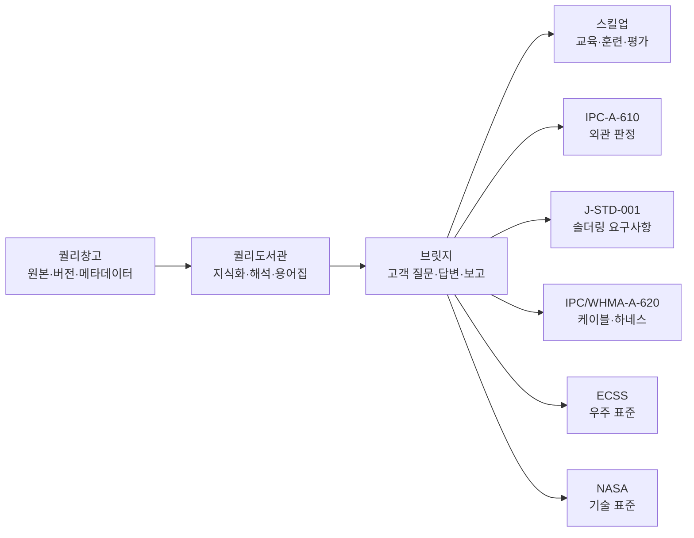

# Quali UI Constitution

> 파일명: `00_QUALI_UI_CONSTITUTION.md`  
> 프로젝트: Quali UI System  
> 버전: v0.1.0  
> 상태: Active  
> 기준일: 2026-06-29  
> 적용 범위: 퀄리창고, 퀄리도서관, 브릿지, 스킬업, IPC-A-610, J-STD-001, IPC/WHMA-A-620, ECSS, NASA, 고객별 표준 모듈

---

## 1. 헌법의 목적

이 문서는 퀄리 시리즈 UI의 최상위 헌법이다.  
모든 화면, HTML 산출물, 교육 UI, 표준 검색 UI, 고객 소통 UI, 보고서형 UI, Codex 작업 지시, Skill 작업은 본 헌법을 우선 적용한다.

퀄리 UI는 일반적인 SaaS 화면이 아니다.  
퀄리 UI는 **표준·품질·교육·검증·근거 추적을 위한 고신뢰 작업대 UI**다.

---

## 2. 공식 제품명 고정

아래 명칭은 내부 브랜드명이자 공식 제품명으로 고정한다.

| 공식 제품명 | 영문 보조명 | 역할 | 표기 원칙 |
|---|---|---|---|
| 퀄리창고 | Quali Warehouse | 원본 자료 저장·버전 추적·메타데이터 관리 | 한글 공식명 우선 |
| 퀄리도서관 | Quali Library | 표준 지식화·용어집·판정 기준·교육 설명 | 한글 공식명 우선 |
| 브릿지 | Bridge | 고객 질문과 표준 지식의 소통 인터페이스 | 한글 공식명 우선 |
| 스킬업 | Skill-up | 교육·훈련·퀴즈·복습·평가 | 한글 공식명 우선 |

영문 보조명은 코드, 파일명, 국제 발표, API, 데이터베이스 식별자에서만 보조적으로 사용한다. 사용자 화면의 1차 표기는 한글 공식명이다.

---

## 3. 핵심 정체성

퀄리 UI는 다음 문장으로 정의한다.

> 초보자도 바로 사용할 수 있으나, 전문가가 보아도 표준번호·판정·근거·추적성이 명확한 고신뢰 표준 작업대.

따라서 퀄리 UI는 다음 두 가지를 동시에 만족해야 한다.

1. **초딩도 바로 쓰는 쉬움**: 사용자는 10초 안에 첫 행동을 알아야 한다.
2. **전문가가 신뢰하는 엄격함**: 표준번호, 개정, 조항, 상태, 근거, 다음 조치가 보여야 한다.

---

## 4. 10대 가치

| 순위 | 가치 | 정의 | UI에서의 구현 |
|---:|---|---|---|
| 1 | 쉬움 | 초보자가 바로 행동할 수 있음 | 동사형 버튼, 명확한 첫 행동, 짧은 문장 |
| 2 | 표준성 | 표준번호·개정·상태가 드러남 | Standard Context Bar, Standard Code Badge |
| 3 | 신뢰성 | 근거와 판단 과정이 추적됨 | Evidence Box, Trace Table |
| 4 | 전문성 | 전문가 집단 운영 인상 | 절제된 색, 명확한 정보 위계, 표 중심 구조 |
| 5 | 간결성 | 한 화면 한 목적 | 주요 버튼 1개, 불필요한 장식 제거 |
| 6 | 여백 | 정보 구분과 피로 감소 | 8px 기반 spacing, 과밀 금지 |
| 7 | 모듈성 | 각 제품이 같은 문법을 공유 | 공통 토큰, 공통 컴포넌트 |
| 8 | 추적성 | 입력에서 결과까지 연결됨 | 입력 → 기준 → 판정 → 근거 → 조치 |
| 9 | 접근성 | 색각·저시력·키보드 사용자도 사용 가능 | 대비, 포커스, 라벨, 색상 단독 전달 금지 |
| 10 | 재사용성 | 한 번 만든 규칙이 반복 적용됨 | Guidebook, Memory, Skill, AGENTS 연계 |

---

## 5. 절대 흐름

모든 주요 화면과 산출물은 아래 흐름을 따른다.

```text
입력 → 기준 → 판정 → 근거 → 조치
```

이 흐름이 보이지 않으면 퀄리 UI가 아니다.

### 5.1 입력

사용자가 넣거나 선택한 데이터다.

예:
- 표준번호
- 문서명
- 고객 질문
- 이미지
- 불량 사례
- 교육 대상
- 파일

### 5.2 기준

판단에 적용되는 표준·규칙·정책이다.

예:
- IPC-A-610
- J-STD-001
- IPC/WHMA-A-620
- ECSS-Q-ST 계열
- NASA-STD 계열
- 고객사 내부 기준
- 교육 운영 규칙

### 5.3 판정

입력과 기준을 비교한 결과다.

허용 상태:
- PASS
- HOLD
- FAIL
- INFO
- DRAFT
- READY
- ARCHIVED

### 5.4 근거

판정을 뒷받침하는 문서, 조항, 페이지, 발췌, 파일명, 신뢰 수준이다.

### 5.5 조치

사용자가 다음에 해야 할 일이다.

예:
- 근거 확인
- 판정표 생성
- 교육자료 만들기
- 고객 답변 생성
- 보고서 출력
- 추가 검토 요청

---

## 6. 이중 설명 원칙

퀄리 UI의 모든 핵심 결과는 다음 두 층을 가진다.

| 층 | 목적 | 표시 방식 |
|---|---|---|
| 초보자 설명 | 바로 이해 | Beginner Box |
| 전문가 근거 | 신뢰와 검증 | Expert Box / Evidence Box |

초보자 설명만 있고 근거가 없으면 교육용 설명은 될 수 있어도 퀄리 UI가 아니다.  
전문가 근거만 있고 쉬운 설명이 없으면 표준 문서 뷰어일 수는 있어도 퀄리 UI가 아니다.

---

## 7. 디자인 철학

디자인은 장식이 아니다.  
퀄리 UI에서 디자인은 **판단 속도, 신뢰감, 근거 추적성, 교육 전달력**을 높이는 장치다.

### 7.1 색상의 역할

색상은 의미 전달에만 사용한다.

| 색상 범주 | 의미 |
|---|---|
| Navy | 신뢰, 기준, 시스템 |
| Blue | 정보, 선택, 주요 액션 |
| Gray | 보조 정보, 구조, 경계 |
| White | 정보 집중 영역 |
| Green | PASS, 적합, 완료 |
| Amber | HOLD, 확인 필요, 보류 |
| Red | FAIL, 부적합, 위험 |

### 7.2 폰트의 역할

폰트는 최소화한다.

| 용도 | 폰트 |
|---|---|
| 본문·제목 | Noto Sans KR 계열 |
| 표준번호·코드·파일명 | ui-monospace 계열 |

### 7.3 여백의 역할

여백은 기능이다.  
여백은 정보 구분, 집중, 피로 감소, 전문성을 만든다.

---

## 8. 모듈 동형성 원칙

퀄리창고, 퀄리도서관, 브릿지, 스킬업, 표준 모듈은 기능이 달라도 같은 UI 문법을 써야 한다.



---

## 9. 제품별 핵심 문장

| 제품 | 핵심 문장 |
|---|---|
| 퀄리창고 | 원본을 잃지 않고 버전과 출처를 추적한다. |
| 퀄리도서관 | 어려운 표준을 사용할 수 있는 지식으로 바꾼다. |
| 브릿지 | 내부 표준 지식을 고객 언어로 연결한다. |
| 스킬업 | 사람의 실무 능력을 단계적으로 올린다. |
| IPC-A-610 모듈 | 전자조립품 외관 판정을 표준 기반으로 구조화한다. |
| J-STD-001 모듈 | 솔더링 공정 요구사항을 작업 기준으로 바꾼다. |
| IPC/WHMA-A-620 모듈 | 케이블·하네스 판정을 현장 언어로 바꾼다. |
| ECSS 모듈 | 우주 프로젝트 표준을 분야·상태·문서번호 중심으로 관리한다. |
| NASA 모듈 | NASA 기술 표준을 안전·품질·검증 흐름으로 연결한다. |

---

## 10. 헌법 위반 판정

아래 중 하나라도 발생하면 결과물은 헌법 위반이다.

- 사용자가 다음 행동을 알 수 없다.
- 표준번호나 기준이 보이지 않는다.
- 판정은 있으나 근거가 없다.
- 색상만으로 상태를 전달한다.
- 모듈마다 다른 시각 언어를 쓴다.
- 쉬운 설명과 전문가 근거 중 하나가 없다.
- 임의 색상, 임의 폰트, 임의 카드 스타일이 반복된다.
- Output Gate 없이 제출·출력 가능한 상태로 표시한다.

---

## 11. 최종 문장

> 퀄리 UI는 보기 좋은 화면보다 신뢰 가능한 화면을 우선한다.  
> 퀄리 UI는 일회성 디자인보다 재사용 가능한 시스템을 우선한다.  
> 퀄리 UI는 감성보다 표준, 기준, 근거, 조치를 우선한다.

---

## 근거 문서

본 문서 세트는 다음 공식·1차 기준의 공통 패턴을 퀄리 시리즈에 맞게 재구성한다.

- ISO Standards: 표준 카탈로그, 분야 분류, 검색 중심 구조.
- IEC Webstore / IEC Standards: 전기·전자 표준 카테고리와 문서형 제품 구조.
- OSHA SIC Search: 공식성 배너, 코드·키워드 기반 검색 흐름.
- TTA 고객서비스포털 및 표준화 자료: 한국어 업무형 표준·시험·인증 흐름.
- PRI / Nadcap: 항공·방산·우주 공급망 품질, 감사, 인증, 컴플라이언스 메시지.
- ECSS Active Standards: 문서번호, 상태, 표준 분야, 변경 요청 중심 구조.
- NASA Technical Standards: 문서번호, 버전, 제목, 날짜, 재검증일 중심 테이블 구조.
- JAXA Satellite Projects: 개발·운영·종료 등 프로젝트 상태 생애주기 표시.
- NASA Web Design System: 절제된 파랑·무채색 팔레트, 명확한 정보 위계, 여백.
- U.S. Web Design System: 디자인 토큰, 배너, 검색, 테이블, 알림, 버튼 컴포넌트 운영 방식.
- W3C WCAG 2.2: 대비, 색상 단독 전달 금지, 포커스 표시, 비텍스트 대비 기준.
- OpenAI Codex AGENTS.md / Skills documentation: 프로젝트 지시 파일과 Skill 디렉터리 구조.
