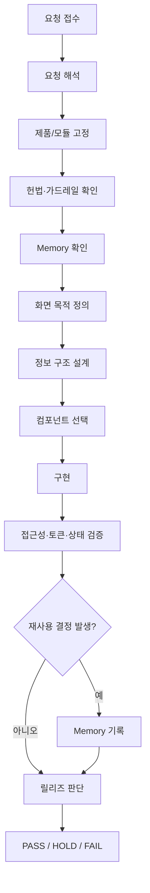

# COMMON_DEVELOPMENT_WORKFLOW.md

> 파일명: `COMMON_DEVELOPMENT_WORKFLOW.md`  
> 프로젝트: Quali UI System  
> 버전: v0.1.1  
> 상태: Active  
> 기준일: 2026-06-29  
> 목적: 사람과 에이전트가 함께 따르는 공통 개발 절차

---

## 1. 원칙

퀄리 UI 개발은 다음 절차를 따른다.

```text
요청 해석 → 기준 확인 → 설계 → 구현 → 검증 → 기록 → 릴리즈 판단
```

모든 화면과 산출물은 다음 정보 흐름을 따른다.

```text
입력 → 기준 → 판정 → 근거 → 조치
```

---

## 2. 전체 절차도



---

## 3. Step 1: 요청 해석

### 목적

사용자 요청을 작업 가능한 단위로 바꾼다.

### 필수 질문

- 무엇을 만들거나 바꾸는가?
- 대상 제품은 무엇인가?
- 대상 사용자는 누구인가?
- 사용자가 첫 10초 안에 해야 할 행동은 무엇인가?
- 적용 기준은 무엇인가?
- 산출물은 화면, 문서, 컴포넌트, 스킬, 보고서 중 무엇인가?

### 산출 템플릿

```text
요청:
목표:
대상 제품:
대상 사용자:
첫 행동:
입력:
기준:
판정 상태:
근거:
출력:
성공 조건:
HOLD:
```

---

## 4. Step 2: 기준 확인

### 반드시 확인할 문서

- `00_QUALI_UI_CONSTITUTION.md`
- `00_QUALI_UI_GUARDRAILS.md`
- `PROJECT_DEVELOPMENT_GUIDEBOOK.md`
- `PROJECT_DEVELOPMENT_MEMORY.md`
- `AGENTS.md`

### 기준 확인 체크리스트

- [ ] 공식 제품명과 충돌하지 않는가?
- [ ] 기존 토큰으로 해결 가능한가?
- [ ] 기존 컴포넌트로 해결 가능한가?
- [ ] 기존 HOLD와 충돌하지 않는가?
- [ ] 표준번호·근거·상태가 필요한 작업인가?
- [ ] 새로운 결정이 Memory 기록 대상인가?

---

## 5. Step 3: 설계

### 설계 순서

1. 화면 목적을 한 문장으로 정의한다.
2. 첫 행동을 한 문장으로 정의한다.
3. 입력 → 기준 → 판정 → 근거 → 조치 흐름을 작성한다.
4. 필요한 컴포넌트를 고른다.
5. 상태 값을 정의한다.
6. 모바일 순서를 정의한다.
7. 접근성 리스크를 예측한다.

### 설계 산출물

```text
화면 목적:
첫 행동:
정보 흐름:
필수 컴포넌트:
상태 값:
모바일 순서:
접근성 리스크:
HOLD:
```

---

## 6. Step 4: 구현

### 구현 원칙

- 기존 토큰 우선
- 기존 컴포넌트 우선
- 새 스타일 최소화
- 의미 있는 HTML 구조
- 테이블에는 caption과 header 제공
- 버튼에는 type 명시
- 아이콘 버튼에는 aria-label 제공
- 상태에는 텍스트 라벨 제공
- focus-visible 유지

### 금지

- 임의 HEX 하드코딩
- 임의 폰트 추가
- 인라인 스타일 남발
- 상태 색상 임의 추가
- evidence 없는 PASS
- 모바일에서 정보 순서 붕괴

---

## 7. Step 5: 검증

| 검증 항목 | 질문 | 판정 |
|---|---|---|
| 쉬움 | 초보자가 10초 안에 첫 행동을 알 수 있는가? | PASS/HOLD/FAIL |
| 표준성 | 표준번호·개정·기준이 보이는가? | PASS/HOLD/FAIL |
| 신뢰성 | 근거와 판정이 연결되는가? | PASS/HOLD/FAIL |
| 전문성 | 장식보다 구조와 근거가 앞서는가? | PASS/HOLD/FAIL |
| 간결성 | 한 화면 한 목적이 유지되는가? | PASS/HOLD/FAIL |
| 여백 | 정보 구분이 명확한가? | PASS/HOLD/FAIL |
| 접근성 | 대비, 포커스, 라벨이 충분한가? | PASS/HOLD/FAIL |
| 모듈성 | 다른 모듈과 같은 UI 문법을 쓰는가? | PASS/HOLD/FAIL |

### 검증 결과 템플릿

```text
검증 요약:
쉬움:
표준성:
신뢰성:
전문성:
간결성:
여백:
접근성:
모듈성:
최종 판정:
HOLD:
```

---

## 8. Step 6: 기록

### Memory 기록 대상

- 공식 명칭 결정
- 새 토큰 승인
- 새 컴포넌트 승인
- 새 상태 값 승인
- 예외 허용
- 반복 오류 방지책
- 모듈 구조 변경
- 출력 게이트 변경

### 기록 템플릿

```text
결정 ID:
날짜:
영역:
결정:
이유:
영향 범위:
상태:
관련 파일:
```

---

## 9. Step 7: 릴리즈 판단

| 판정 | 의미 | 조건 |
|---|---|---|
| PASS | 사용 가능 | 기준 충족, 검증 완료 |
| HOLD | 보류 | 확인 필요 항목 존재 |
| FAIL | 차단 | 헌법·가드레일 위반 |

---

## 10. 제품별 워크플로우

### 퀄리창고

```text
원본 입력 → 메타데이터 확인 → 표준번호 매핑 → 버전 상태 표시 → 원본 저장 → 검색 가능 상태
```

### 퀄리도서관

```text
원본/표준 입력 → 요약 → 초보자 설명 → 전문가 근거 → 용어/조항 연결 → 교육/검색 사용
```

### 브릿지

```text
고객 질문 → 기준 선택 → 답변 생성 → 근거 요약 → 다음 조치 → 보고/교육 연결
```

### 스킬업

```text
학습 목표 → 개념 설명 → 사례 → 실습 → 퀴즈 → 피드백 → 재학습
```

---

## 11. 변경 이력

### v0.1.0 — 2026-06-29

- 초기 정식 워크플로우 생성
- 공식 제품명 고정 반영
- 요청 해석·설계·구현·검증·기록·릴리즈 절차 정의
- 제품별 흐름 추가
